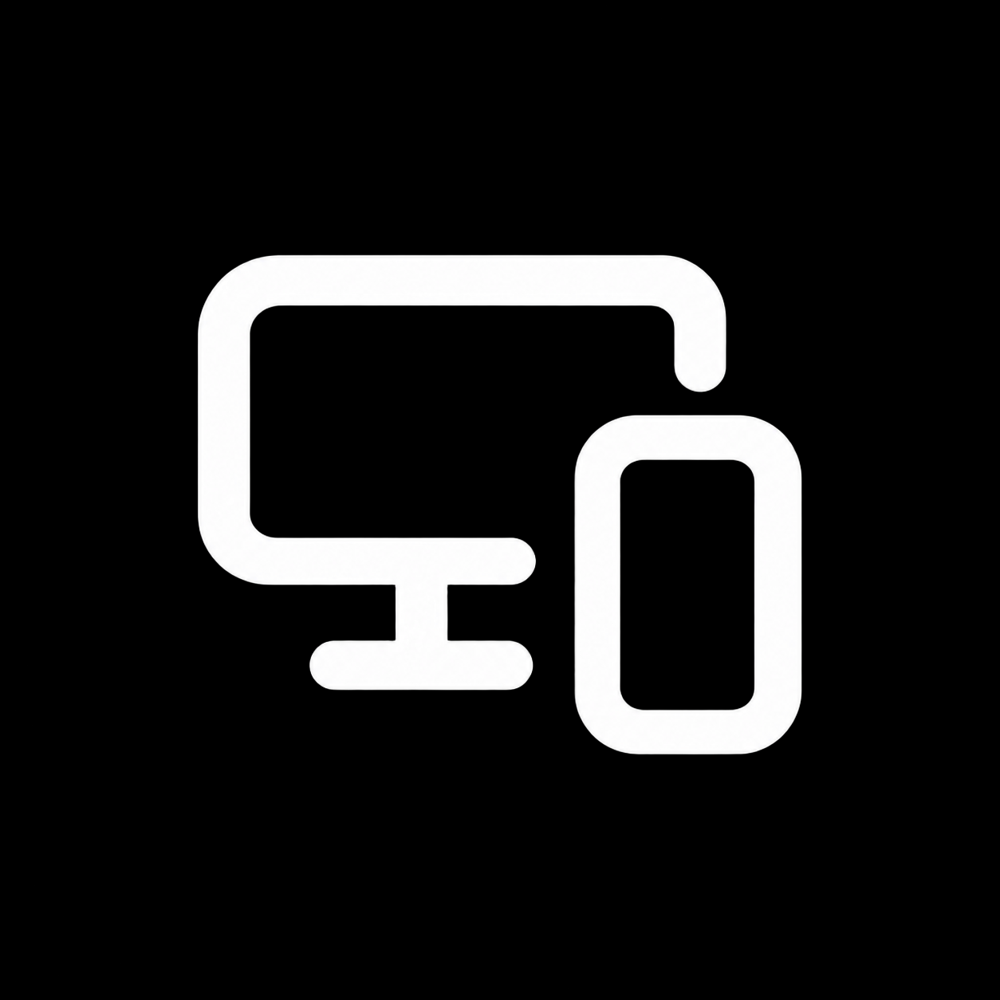

# iMirror

Mirror and control an iPhone from Windows with a lightweight native desktop app.
Built with Rust, windows-rs and Win32, with Media Foundation decoding and D3D11
video rendering. No Electron, WebView, Node.js or Python runtime in the app.

[Hướng dẫn tiếng Việt](HUONG_DAN.md) · [User guide](docs/USER_GUIDE.md) ·
[Build from source](docs/BUILDING.md) · [Contributing](CONTRIBUTING.md)

## Current status

**Engineering preview, not yet a validated public installer release.** USB video
and Bluetooth relative pointer control have worked on a real iPhone. Wireless
video and one WDA click through the live image are also physically confirmed.
Broader hardware compatibility, sustained stability and clean-machine installation
still require validation. See [test evidence and release gates](docs/VALIDATION.md).

| Area | Current implementation |
| --- | --- |
| USB mirroring | QuickTime-compatible encoded video, native hardware/software decoder selection |
| Control | Bluetooth relative mouse and keyboard with iPhone AssistiveTouch |
| Windows UI | Compact native toolbar, system theme, DPI-aware controls and Fluent SVG icons |
| Language | English / Tiếng Việt in Settings → General; saved and applied immediately |
| Wireless | Live video confirmed on one iPhone; long-run and loss/reconnect coverage pending |
| Advanced control | Wireless + WDA clicks and automatic reconnect after app reopening confirmed; initial signed runner/developer setup required |
| Audio | Disabled; this app focuses on mirroring and control |

Targets: Windows 11 x64 and Windows 10 22H2 x64 where APIs/drivers permit; iOS 17+
is the compatibility goal, not a guarantee. Actual FPS, resolution and latency
depend on the phone, protocol and PC. USB and Bluetooth control are separate
connections; USB mirroring does not require Bluetooth control or WDA.

In normal Fit mode, the window follows the connected video's aspect ratio and
stays proportional when resized. Fullscreen preserves the image and may correctly
show black bars. Explicit 1:1 and Fill selections are retained.

## Start using iMirror

Download the **Windows x64 portable ZIP** from
[GitHub Releases](https://github.com/phh235/iphone-mirror-windows/releases).
The current release is **v0.1.0-preview.1**, an unsigned public pre-release.
Extract everything and open `START-HERE.html` for Vietnamese/English instructions,
or `iMirror.exe` to run. Clean-Windows validation is still pending; read the exact
release notes before use. The corresponding-source ZIP is for developers,
not the application download.

[Portable guide — Tiếng Việt](docs/PORTABLE.vi.md) ·
[Portable guide — English](docs/PORTABLE.en.md) ·
[WDA setup — Tiếng Việt](docs/WDA_SETUP.vi.md) · [WDA setup — English](docs/WDA_SETUP.en.md)

For a supplied engineering app folder, keep **all** files beside `iMirror.exe`,
including the USB helpers, DLLs, licenses and `AirPlay`/`WDA` directories. Do not copy the
EXE alone. A fresh Git checkout contains source, not a prebuilt application.

1. Connect the unlocked iPhone by USB and accept **Trust This Computer**.
2. Open iMirror. **Automatic** tries a detected USB phone; otherwise use the
   **Connect** icon. Choose a device in **Settings → Connection** if necessary.
3. For mouse control, enable **Control**, enable iPhone **AssistiveTouch**, and
   pair the PC when iMirror says Bluetooth control is ready for pairing.
4. Click inside the mirrored image to capture input. **Ctrl+Alt+Q** releases it
   immediately; **Esc** also releases captured input.

Detailed setup, icon meanings, sensitivity, wireless and troubleshooting:
[English](docs/USER_GUIDE.md) / [Tiếng Việt](HUONG_DAN.md).

## Development

Rust MSVC and the Visual Studio C++ Build Tools/Windows SDK are needed to build
the native app. Additional tools are needed only for packaging the wireless
runtime and installers. End users do not need these tools.

```powershell
cargo fmt --check
cargo clippy --all-targets --all-features -- -D warnings
cargo test
cargo build --release
```

[Build instructions](docs/BUILDING.md) explain prerequisites, output files,
packaging, tests and cleanup. [Architecture](docs/ARCHITECTURE.md) describes the
module boundaries. Historical experiments are indexed under
[docs/history](docs/history/README.md); they are not current setup instructions.

To keep the checkout small after building, use PowerShell 7:

```powershell
pwsh -File scripts/clean.ps1 -Preview
pwsh -File scripts/clean.ps1
```

Cleanup preserves the newest staged app, source, Git history and rollback refs.
It archives and verifies bulky test evidence before removing it. Build caches,
local diagnostics and packaged binaries are ignored by Git and regenerate when
needed. See [cleanup details](docs/BUILDING.md#cleanup).

## License and attribution

iMirror is licensed under [GPL-3.0-only](LICENSE). The native media components,
Bluetooth HID reference, Fluent icons and other dependencies retain their own
licenses and notices. See [THIRD_PARTY_LICENSES.md](THIRD_PARTY_LICENSES.md) and
[distribution requirements](docs/LICENSING.md). A process boundary does not by
itself remove GPL obligations.

iMirror is an independent project, not affiliated with, endorsed by, or sponsored
by Apple Inc. or Microsoft Corporation. Product names and trademarks, including
iPhone, iOS, AirPlay and Windows, belong to their respective owners.
No Apple proprietary binaries or signing credentials are distributed here.
